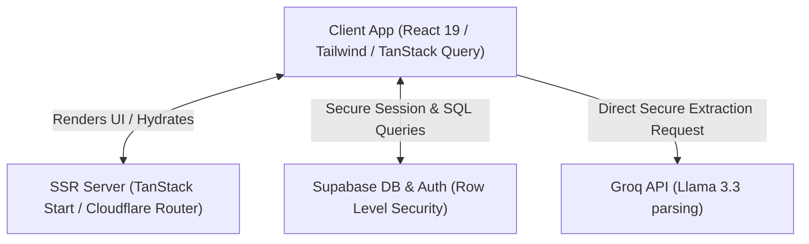

# Tracely - Job Application Tracker

Job hunting is a full-time job. Between copy-pasting descriptions, keeping track of different interviews, and managing chaotic spreadsheets, it's easy to get overwhelmed.

Tracely is a clean, simple tool built to take the friction out of tracking your job search. It's designed to be fast, minimal, and save you time.

- No subscriptions, paywalls, or premium tiers. It's completely free and open.
- No ads or tracking.
- Clean UI that gets out of the way.
- Time-saving auto-fill features.

---

## Tech Stack

- React 19
- TanStack Start (with Cloudflare & Vite)
- Tailwind CSS v4 & shadcn/ui
- Supabase (Database & Authentication)
- TypeScript

---

## Features

- **Auto-Fill:** Paste a job description and company name, and the tool extracts the job title, location, salary range, work style (Remote/Hybrid/On-site), platform, and key requirements.
- **Stats Dashboard:** Simple counters showing active applications, interviews scheduled, offers, and rejections.
- **Job Board:** A filterable, searchable table to manage all your applications and notes in one place.
- **Resume Management:** Upload, preview, and download different versions of your resume (PDF or Word format). Link them directly to specific applications so you always know which version you applied with.
- **Job Analytics:** Visual insights and charts for your job search, including application growth over time, platform breakdowns, and conversion insights showing which resumes and roles get the most interview callbacks.
- **Custom Statuses:** Add or modify application stages, platform names, and tags dynamically.
- **Secure Auth:** Secure user authentication powered by Supabase, ensuring your application data remains private to you.
- **Responsive:** Works on desktop, tablet, and mobile.

---

## Architecture

Tracely uses a high-performance web architecture designed to keep your data fast and secure:



1.  **Frontend (React 19 & Tailwind CSS v4)**: Uses shadcn/ui components for a clean and responsive UI.
2.  **Routing & SSR (TanStack Start)**: Manages layouts, server-side rendering, and type-safe routing.
3.  **State Management (TanStack Query)**: Syncs local UI state with the Supabase database.
4.  **Database & Authentication (Supabase)**: Handles user login and registration. Row Level Security (RLS) is enabled, meaning users can only access their own data.
5.  **Description Parser (Groq API)**: Fetches directly from the Groq API on the client side to parse raw job text into structured fields.

---

## Local Setup

### 1. Clone the repository

```bash
git clone https://github.com/samarthkashyap03/tracely
cd job-tracker
```

### 2. Install dependencies

```bash
npm install
```

### 3. Configure environment variables

Create a `.env` file in the root directory (based on `.env.example`):

```env
VITE_SUPABASE_URL=https://your-project.supabase.co
VITE_SUPABASE_ANON_KEY=your-anon-key
VITE_GROQ_API_KEY=your-groq-api-key # Optional: key can also be configured dynamically in settings
```

Replace the values with your actual Supabase Project URL and Anon Public Key from the Supabase Dashboard (Settings > API).

### 4. Set up the Database Schema

Execute the SQL commands in `supabase/schema.sql` inside your Supabase SQL Editor to set up the necessary tables (`job_applications` and `user_options`) and Row Level Security (RLS) policies.

### 5. Run the development server

```bash
npm run dev
```

Open `http://localhost:8080` in your browser.
